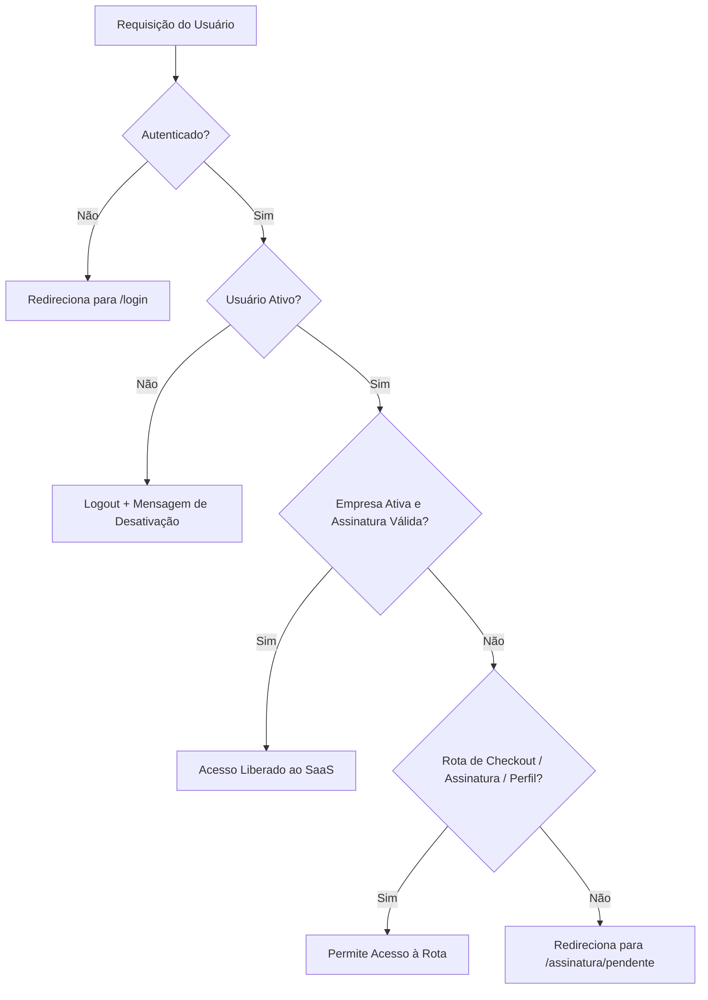
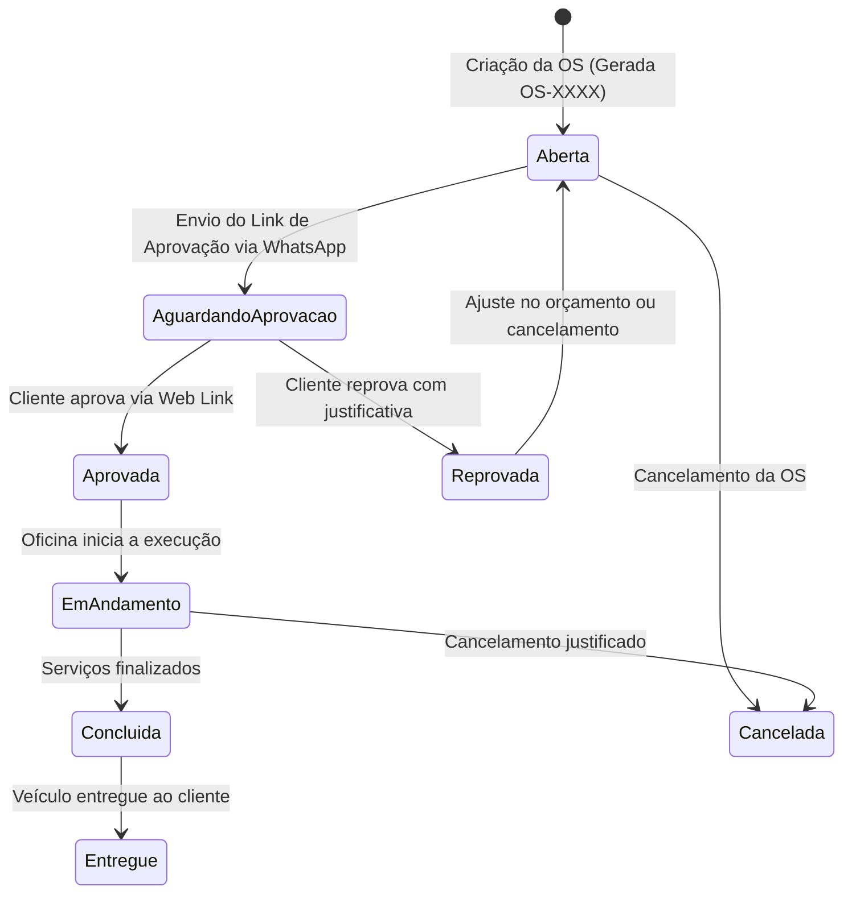

# Documento de Revisão e Arquitetura do Sistema — MecDesk SaaS

> **Data de Atualização:** 30 de Setembro de 2026  
> **Versão do Sistema:** MecDesk v1.2 (Produção/Estável)  
> **Stack Base:** PHP 8.3+ | Laravel 11/13 | Mercado Pago SDK & Subscriptions API v2 | MySQL / SQLite | Tailwind CSS | DomPDF

---

## 1. Visão Geral do Projeto

O **MecDesk** é uma plataforma **SaaS (Software as a Service) Multi-Tenant** desenvolvida para a gestão integrada e profissional de **oficinas mecânicas, auto centers e prestadores de serviços automotivos**.

### Objetivos do Sistema:
1. **Padronização Operacional**: Centralizar cadastros de clientes, veículos, catálogo de peças e tabela de serviços.
2. **Ciclo de Vida Completo de Ordens de Serviço (OS)**: Da entrada do veículo à entrega, incluindo fotos de avarias, controle de estoque atômico e geração de PDFs.
3. **Aprovação Digital sem Fricção**: Envio de links únicos via WhatsApp para que os clientes aprovem ou reprovem orçamentos em tempo real diretamente pelo celular, com registro de auditoria (IP, data e navegador).
4. **Monetização SaaS Automatizada**: Cobrança de mensalidade via **assinatura recorrente no cartão de crédito** através da API oficial de Subscriptions do **Mercado Pago** (`/preapproval`), com processamento assíncrono de webhooks e gestão de carência/inadimplência.

---

## 2. Arquitetura do Sistema e Multi-Tenancy

### 2.1 Modelo de Isolamento Multi-Tenant
O MecDesk adota uma estratégia de banco de dados compartilhado com **isolamento lógico estrito por coluna (`empresa_id`)**:

* **Tenant Raiz**: Modelo [`Empresa`](file:///c:/Users/João%20Pedro/Documents/workspace-dev/Mecdesk/app/Models/Empresa.php).
* **Escopo Global Eloquent (`EmpresaScope`)**:
  Todos os modelos operacionais ([`OrdemServico`](file:///c:/Users/João%20Pedro/Documents/workspace-dev/Mecdesk/app/Models/OrdemServico.php), [`Cliente`](file:///c:/Users/João%20Pedro/Documents/workspace-dev/Mecdesk/app/Models/Cliente.php), [`Veiculo`](file:///c:/Users/João%20Pedro/Documents/workspace-dev/Mecdesk/app/Models/Veiculo.php), [`Peca`](file:///c:/Users/João%20Pedro/Documents/workspace-dev/Mecdesk/app/Models/Peca.php), [`Servico`](file:///c:/Users/João%20Pedro/Documents/workspace-dev/Mecdesk/app/Models/Servico.php)) utilizam o [`EmpresaScope`](file:///c:/Users/João%20Pedro/Documents/workspace-dev/Mecdesk/app/Models/Scopes/EmpresaScope.php).
  ```php
  // Regra automática em todas as queries:
  $builder->where($model->getTable() . '.empresa_id', auth()->user()->empresa_id);
  ```
* **Auto-atribuição no Create**: No momento de criação de registros via Eloquent, o `empresa_id` é automaticamente injetado a partir do usuário autenticado no evento `creating`.

### 2.2 Hierarquia de Usuários e Permissões (RBAC)
Cada usuário possui um perfil (`role`) associado à sua empresa:

| Perfil (`role`) | Visualizar | Criar / Editar | Excluir Registros | Gerenciar Usuários | Gerenciar Assinatura / Oficina |
| :--- | :---: | :---: | :---: | :---: | :---: |
| **Admin** | Sim | Sim | Sim | Sim | Sim |
| **Gerente** | Sim | Sim | Sim | Não | Não |
| **Funcionário** | Sim | Sim | Não | Não | Não |

### 2.3 Barreira de Acesso e Middleware (`EnsureEmpresaAtiva`)
O middleware [`EnsureEmpresaAtiva`](file:///c:/Users/João%20Pedro/Documents/workspace-dev/Mecdesk/app/Http/Middleware/EnsureEmpresaAtiva.php) protege todas as rotas operacionais do SaaS:
1. Verifica se o usuário autenticado está marcado como ativo (`isAtivo()`).
2. Verifica se a empresa existe e está ativa (`empresa->isAtiva()`).
3. **Condição de Empresa Ativa**: A empresa só tem acesso liberado se possuir uma assinatura com `status = 'authorized'` ou estiver em período residual válido após cancelamento (`valido_ate > now()`).
4. **Tratamento de Inadimplência / Pendência**: Usuários com pagamentos pendentes ou contas suspensas são direcionados automaticamente para a tela `/assinatura/pendente`, mantendo acesso liberado apenas para checkout, gestão de pagamento e edição de perfil.



---

## 3. Módulo de Assinaturas e Pagamento Recorrente

A cobrança recorrente do MecDesk foi concebida utilizando a **API oficial de Assinaturas (Preapproval) do Mercado Pago**, eliminando necessidade de armazenamento sensível de dados de cartão na aplicação (PCI-DSS Compliance).

### 3.1 O Plano Comercial
* **Plano Pro**: R$ 99,90 / mês.
* **Recursos**: Acesso total a todas as funcionalidades, multiusuário até o limite cadastrado na tabela de planos, cadastro ilimitado de ordens, clientes, veículos e catálogo de peças/serviços.

### 3.2 O Fluxo de Onboarding e Contratação (3 Etapas)
Controlado por [`CheckoutController`](file:///c:/Users/João%20Pedro/Documents/workspace-dev/Mecdesk/app/Http/Controllers/CheckoutController.php) na rota `/contratar`:

1. **Etapa 1: Cadastro da Conta e Empresa**
   * Rota: `POST /contratar/criar-conta`
   * Executa uma transação de banco de dados (`DB::transaction`):
     - Cria o registro de [`Empresa`](file:///c:/Users/João%20Pedro/Documents/workspace-dev/Mecdesk/app/Models/Empresa.php) com `ativo = false`.
     - Cria o registro de [`Assinatura`](file:///c:/Users/João%20Pedro/Documents/workspace-dev/Mecdesk/app/Models/Assinatura.php) inicial com `status = 'pending'`, `metodo_pagamento = 'cartao'`, `preco_contratado = 99.90`.
     - Cria o primeiro [`User`](file:///c:/Users/João%20Pedro/Documents/workspace-dev/Mecdesk/app/Models/User.php) como `admin`.
     - Dispara o evento `Registered` e autentica o usuário via `Auth::login()`.

2. **Etapa 2: Coleta Segura do Cartão (Mercado Pago Tokenization Brick)**
   * No navegador do usuário, o script do Mercado Pago v2 tokeniza os dados do cartão de crédito (número, titular, validade, CVV).
   * O formulário **não envia** os dados do cartão para o servidor MecDesk; apenas o `card_token_id` criptografado é retornado pelo Mercado Pago.

3. **Etapa 3: Processamento do Débito e Criação do Preapproval**
   * Rota: `POST /checkout/processar` (com `throttle:10,1` e proteção contra duplicidade).
   * **Zero-Trust Server-Side**: O servidor busca o plano Pro no banco de dados e fixa o valor em R$ 99,90, descartando qualquer parâmetro financeiro manipulado pelo cliente.
   * Utiliza cabeçalho `X-Idempotency-Key` (UUID) para evitar cobranças em duplicidade decorrentes de cliques múltiplos ou oscilações de rede.

### 3.3 Chamadas de API Realizadas ([`MercadoPagoService`](file:///c:/Users/João%20Pedro/Documents/workspace-dev/Mecdesk/app/Services/MercadoPago/MercadoPagoService.php))

| Ação | Método / Endpoint Mercado Pago | Parâmetros Principais | Objetivo |
| :--- | :--- | :--- | :--- |
| **Criar Assinatura** | `POST https://api.mercadopago.com/preapproval` | `reason`, `external_reference` (empresa_id), `payer_email`, `card_token_id`, `auto_recurring` (freq: 1 mês, BRL, 99.90), `back_url`, `status: authorized` | Cria a assinatura recorrente com débito automático mensal no cartão. |
| **Atualizar Cartão** | `PUT https://api.mercadopago.com/preapproval/{id}` | `card_token_id` | Atualiza o cartão de uma assinatura pendente sem duplicar contratos. |
| **Consultar Assinatura** | `GET https://api.mercadopago.com/preapproval/{id}` | Token de autorização Bearer | Validação Zero-Trust após recebimento de notificação webhook. |
| **Consultar Cobrança** | `GET https://api.mercadopago.com/authorized_payments/{id}` | Token de autorização Bearer | Consulta o status real da cobrança individual mensal gerada pelo gateway. |
| **Cancelar Assinatura** | `PUT https://api.mercadopago.com/preapproval/{id}` | `status: "cancelled"` | Cancela definitivamente a assinatura recorrente na infraestrutura do Mercado Pago. |

### 3.4 Processamento de Webhooks e Resiliência a Falhas
A comunicação contínua entre o gateway e o MecDesk ocorre via Webhooks:

* **Endpoint**: `POST /webhooks/mercadopago` ([`WebhookController`](file:///c:/Users/João%20Pedro/Documents/workspace-dev/Mecdesk/app/Http/Controllers/WebhookController.php)).
* **Validação Criptográfica HMAC SHA-256**: O [`WebhookValidator`](file:///c:/Users/João%20Pedro/Documents/workspace-dev/Mecdesk/app/Services/MercadoPago/WebhookValidator.php) valida o cabeçalho `x-signature` contra a chave secreta configurada em `config('mercadopago.webhook_secret')`, barrando tentativas de injeção externa.
* **Auditoria Imediata**: Toda notificação bruta é armazenada na tabela `webhook_logs` antes de qualquer execução.
* **Resposta Rápida (HTTP 200)**: O controlador responde imediatamente com `HTTP 200 OK` ao Mercado Pago para evitar cancelamentos ou retentativas indesejadas pelo gateway.
* **Fila Assíncrona com Trava de Linha**: A execução é despachada para o Job [`ProcessarWebhookMercadoPago`](file:///c:/Users/João%20Pedro/Documents/workspace-dev/Mecdesk/app/Jobs/ProcessarWebhookMercadoPago.php), protegido por transação de banco com `lockForUpdate()`.

#### Tratamento dos Eventos de Webhook:
1. **`subscription_preapproval` (Alteração Cadastral da Assinatura)**:
   - Se status mudar para `cancelled` ou `paused`: assinatura atualizada localmente e acesso da empresa revogado (`empresa->ativo = false`).
   - Se status for `authorized`: se a assinatura não estiver com status `overdue`, confirma a ativação da empresa.
2. **`subscription_authorized_payment` (Cobrança Mensal Efetiva)**:
   - Consulta a cobrança autorizada via `GET /authorized_payments/{id}`.
   - Registra ou atualiza o modelo [`Pagamento`](file:///c:/Users/João%20Pedro/Documents/workspace-dev/Mecdesk/app/Models/Pagamento.php).
   - Se `status === 'approved'`:
     - Assinatura passa para `authorized`.
     - `proximo_vencimento` e `valido_ate` são prorrogados para `now()->addMonth()`.
     - A empresa é mantida/marcada como ativa (`empresa->ativo = true`).
     - Dispara eventos: `AssinaturaAtivada` e `PagamentoRecebido`.
   - Se `status === 'rejected'`:
     - Dispara evento `PagamentoRecusado` para notificar a oficina de que o cartão falhou na renovação mensal.

### 3.5 Política de Carência e Inadimplência
* **Rotina Automática Diária**: Configurada em [`routes/console.php`](file:///c:/Users/João%20Pedro/Documents/workspace-dev/Mecdesk/routes/console.php) para rodar às **02:00**:
  ```php
  Schedule::command('mecdesk:verificar-assinaturas-vencidas')->dailyAt('02:00');
  ```
* **Prazo de Carência de 3 Dias**: O comando [`VerificarAssinaturasVencidasCommand`](file:///c:/Users/João%20Pedro/Documents/workspace-dev/Mecdesk/app/Console/Commands/VerificarAssinaturasVencidasCommand.php) busca assinaturas `authorized` cujo `valido_ate` acrescido dos 3 dias de tolerância já venceu (`valido_ate <= now()->subDays(3)`).
* **Bloqueio Justo**: Apenas após o esgotamento desse prazo a assinatura é marcada como `overdue` e `empresa->ativo = false`.
* **Garantia Pós-Cancelamento**: Se o administrador cancelar o plano na tela `/minha-assinatura`, a assinatura é cancelada na API do Mercado Pago, mas o método `isValida()` em `Assinatura.php` e `isAtiva()` em `Empresa.php` garantem que **a oficina continue usando o sistema até a data limite já quitada (`valido_ate`)**.

---

## 4. Funcionalidades Operacionais do Sistema

### 4.1 Dashboard Executivo ([`DashboardController`](file:///c:/Users/João%20Pedro/Documents/workspace-dev/Mecdesk/app/Http/Controllers/DashboardController.php))
* **Contadores Dinâmicos**: Total de clientes, veículos cadastrados, ordens de serviço ativas e serviços catalogados.
* **Métricas Financeiras**: Faturamento total acumulado em ordens concluídas e faturamento do mês corrente.
* **Painel de Ordens por Status**: Aberta, Em andamento, Concluída e Cancelada.
* **Gráficos Analíticos**:
  - Evolução do faturamento mês a mês (com queries dinâmicas compatíveis com SQLite e MySQL).
  - Distribuição percentual de ordens por status.
  - Top 5 serviços mais realizados.
  - Top 5 peças mais demandadas.
* **Alerta Crítico de Estoque**: Tabela de acesso rápido destacando peças com estoque inferior ou igual a 5 unidades.

### 4.2 Gestão de Clientes ([`ClienteController`](file:///c:/Users/João%20Pedro/Documents/workspace-dev/Mecdesk/app/Http/Controllers/ClienteController.php))
* Cadastro com Nome, CPF/CNPJ, Telefone celular, WhatsApp, E-mail e Endereço.
* Filtro de busca inteligente (pesquisa por nome, números limpos de documento ou telefone).
* Relacionamento 1:N com veículos pertencentes ao cliente.
* **Proteção de Integridade**: Bloqueio de exclusão caso o cliente possua Ordens de Serviço registradas no histórico.

### 4.3 Gestão de Veículos ([`VeiculoController`](file:///c:/Users/João%20Pedro/Documents/workspace-dev/Mecdesk/app/Http/Controllers/VeiculoController.php))
* Dados cadastrais: Placa, Marca, Modelo, Ano de Fabricação, Cor, Quilometragem atual, Tipo de Combustível, Renavam e Chassi.
* Vinculação obrigatória ao Cliente proprietário.
* Filtros de busca por placa, marca, modelo ou proprietário.
* Proteção contra exclusão caso existam ordens vinculadas.

### 4.4 Catálogo de Peças e Gestão de Estoque ([`PecaController`](file:///c:/Users/João%20Pedro/Documents/workspace-dev/Mecdesk/app/Http/Controllers/PecaController.php))
* Código interno/SKU, nome da peça, descrição técnica, estoque atual, estoque mínimo recomendado, valor de custo e valor de venda unitário.
* Filtros por faixa de valor, quantidade em estoque e código.
* **Modo Opcional de Estoque**: A empresa pode ligar ou desligar o controle rígido de estoque nas configurações da oficina (`controle_estoque`).

### 4.5 Catálogo de Serviços de Mão de Obra ([`ServicoController`](file:///c:/Users/João%20Pedro/Documents/workspace-dev/Mecdesk/app/Http/Controllers/ServicoController.php))
* Tabela de serviços com nome, descrição detalhada e valor base de mão de obra.

---

### 4.6 O Módulo de Ordens de Serviço (Núcleo do Negócio)
Controlado por [`OrdemServicoController`](file:///c:/Users/João%20Pedro/Documents/workspace-dev/Mecdesk/app/Http/Controllers/OrdemServicoController.php) e alimentado por serviços especializados.



#### 4.6.1 Sequencial Seguro de OS por Oficina
* Geração do formato `OS-0001`, `OS-0002`... garantida por bloqueio pessimista (`lockForUpdate`) no banco de dados, impedindo números repetidos mesmo durante requisições simultâneas.

#### 4.6.2 Motor de Estoque Atômico ([`OrdemServicoItemService`](file:///c:/Users/João%20Pedro/Documents/workspace-dev/Mecdesk/app/Services/OrdemServicoItemService.php))
* **Itens do Catálogo e Itens Avulsos**: A OS aceita peças e serviços do catálogo cadastrado ou itens personalizados digitados na hora.
* **Transações com Lock**: A inclusão de peças realiza `Peca::lockForUpdate()` e decrementa o saldo de estoque imediatamente.
* **Ajuste Proporcional por Delta**: Caso o usuário altere a quantidade de um item de 2 para 5 unidades, o sistema reserva apenas as 3 unidades de diferença. Caso diminua de 5 para 3, estorna 2 unidades para o estoque.
* **Estorno Integral**: Remover um item da OS ou excluir a OS inteira devolve automaticamente todas as peças ao estoque da oficina.
* **Recálculo em Cascata**: Qualquer adição, edição ou remoção recalcula atopicamente o `valor_total` da ordem.

#### 4.6.3 Vistoria e Galeria de Fotos de Avarias
* Upload de múltiplas fotografias de avarias na abertura da OS ou durante o check-in.
* **Regra de Imutabilidade**: Upload ou exclusão de fotos de avarias só é autorizado enquanto a OS estiver no estado **`aberta`**, preservando a integridade legal da vistoria após o envio ao cliente.

#### 4.6.4 Portal de Aprovação Digital do Cliente (Sem Login)
Controlado por [`AprovacaoController`](file:///c:/Users/João%20Pedro/Documents/workspace-dev/Mecdesk/app/Http/Controllers/AprovacaoController.php):
1. **Geração de Token**: A oficina clica em "Solicitar Aprovação". O sistema gera um UUID criptográfico de 15 dias de validade e transiciona a OS para `aguardando_aprovacao`.
2. **Integração WhatsApp Instantânea**: O sistema gera um link formatado `wa.me` com o primeiro nome do cliente, placa do veículo, valor total e a URL exclusiva (`https://meusite.com/aprovacao/{token}`).
3. **Página Pública Responsiva**: O cliente abre no smartphone, confere a lista completa de peças, serviços, fotos das avarias e valor total.
4. **Decisão do Cliente**:
   * **Aprovar**: Transiciona a OS para `aprovada`, registra data/hora, endereço IP e User-Agent do dispositivo para validade jurídica.
   * **Reprovar**: Exige o preenchimento de um motivo/comentário e transiciona a OS para `reprovada`.

#### 4.6.5 Geração de Documentos em PDF (DomPDF)
* **Orçamento / OS Completa** (`/ordens/{ordem}/pdf`): Layout limpo com o logotipo da oficina, dados cadastrais da empresa, dados do cliente, identificação do veículo, tabela discriminada de itens e campo de assinatura física.
* **Ficha de Vistoria de Entrada** (`/ordens/{ordem}/pdf-vistoria`): Focada no estado de conservação do veículo e galeria de fotos de avarias.

---

### 4.7 Gestão da Oficina e Equipe

* **Perfil e Logotipo da Oficina (`/empresa`)**:
  - Razão Social, Nome Fantasia, CNPJ, WhatsApp, E-mail, CEP e Endereço.
  - Upload e substituição de logotipo (com limpeza automática do arquivo anterior no Storage).
  - Configuração do modo de controle de estoque.
* **Equipe de Funcionários (`/usuarios`)**:
  - Cadastro de novos membros com controle estrito do limite de usuários do plano (`max_usuarios`).
  - Ativação / Desativação instantânea de contas (com bloqueio imediato via middleware).
  - Bloqueio de autoexclusão ou autodesativação do administrador logado.
* **Autoatendimento da Assinatura (`/minha-assinatura`)**:
  - Painel com resumo do plano, valor mensal, próximo vencimento e status atual.
  - Ação de cancelamento seguro com confirmação e chamada direta à API do Mercado Pago.

---

## 5. Mapeamento Geral de Rotas da Aplicação

| Rota | Método | Finalidade | Middleware de Acesso |
| :--- | :---: | :--- | :--- |
| `/` | `GET` | Redirecionamento inteligente (Dashboard se logado / Planos se anônimo) | Público |
| `/planos` | `GET` | Apresentação pública do Plano Pro e benefícios | Público |
| `/contratar` | `GET` | Tela unificada de contratação / checkout em 3 etapas | Público / Auth |
| `/contratar/criar-conta` | `POST` | Criação da conta de usuário e oficina na Etapa 1 | Público (`throttle:5,1`) |
| `/checkout/processar` | `POST` | Disparo da criação de assinatura recorrente no Mercado Pago | `auth` (`throttle:10,1`) |
| `/planos/callback` | `GET` | Retorno do gateway de pagamento | `auth` |
| `/assinatura/pendente` | `GET` | Sala de espera enquanto o pagamento é processado | `auth` |
| `/assinatura/status` | `GET` | Polling AJAX para detecção em tempo real de ativação | `auth` |
| `/assinatura/sucesso` | `GET` | Tela de boas-vindas após confirmação de pagamento | `auth` |
| `/minha-assinatura` | `GET` | Consulta e cancelamento de assinatura | `auth` |
| `/assinatura/cancelar` | `POST` | Execução do cancelamento no Mercado Pago e local | `auth` |
| `/webhooks/mercadopago` | `POST` | Recepção de webhooks de assinatura e cobrança | Público (`throttle:60,1`) |
| `/aprovacao/{token}` | `GET` | Tela pública de aprovação de OS pelo cliente | Público |
| `/aprovacao/{token}/aprovar` | `POST` | Confirmação de aprovação pelo cliente | Público (`throttle:10,1`) |
| `/aprovacao/{token}/reprovar` | `POST` | Registro de recusa com motivo pelo cliente | Público (`throttle:10,1`) |
| `/dashboard` | `GET` | Visão geral, gráficos analíticos e alertas | `auth`, `empresa.ativa` |
| `/empresa` | `GET`, `PUT` | Dados da oficina, logotipo e opções | `auth`, `empresa.ativa` |
| `/usuarios/*` | Vários | Cadastro, ativação e exclusão de funcionários | `auth`, `empresa.ativa` |
| `/clientes/*` | Resource | CRUD completo de clientes | `auth`, `empresa.ativa` |
| `/veiculos/*` | Resource | CRUD completo de veículos | `auth`, `empresa.ativa` |
| `/pecas/*` | Resource | CRUD e estoque de peças | `auth`, `empresa.ativa` |
| `/servicos/*` | Resource | CRUD de serviços de mão de obra | `auth`, `empresa.ativa` |
| `/ordens/*` | Resource | CRUD e ciclo de vida de Ordens de Serviço | `auth`, `empresa.ativa` |
| `/ordens/{ordem}/itens/*` | Vários | Gestão atômica de peças e serviços na OS | `auth`, `empresa.ativa` |
| `/ordens/{ordem}/fotos/*` | Vários | Upload e remoção de imagens de avarias | `auth`, `empresa.ativa` |
| `/ordens/{ordem}/pdf` | `GET` | Download do PDF completo do orçamento/OS | `auth`, `empresa.ativa` |
| `/ordens/{ordem}/pdf-vistoria`| `GET` | Download do PDF de vistoria de entrada | `auth`, `empresa.ativa` |
| `/ordens/{ordem}/solicitar-aprovacao` | `POST`| Gera token e link de WhatsApp para o cliente | `auth`, `empresa.ativa` |

---

## 6. Diagnóstico de Qualidade e Segurança

### Pontos Fortes:
* **Princípio Zero-Trust em Pagamentos**: O sistema não confia em valores vindos do cliente nem nos dados crus contidos no corpo dos webhooks; todas as consultas são autenticadas diretamente contra a API do Mercado Pago.
* **Concorrência Protegida**: Numeração de OS, movimentação de estoque de peças e processamento de webhooks utilizam `lockForUpdate()` e transações de banco de dados (`DB::transaction`).
* **Isolamento Multi-Tenant Consistente**: Impossibilidade de vazamento de dados entre oficinas graças ao `EmpresaScope` e validações de pertencimento nos controladores.
* **Experiência do Usuário (UX)**: O cliente final não precisa criar login ou instalar aplicativos para aprovar seu orçamento; todo o fluxo ocorre via link autenticado de WhatsApp.
* **Tratamento de Erros Amigável**: Mapeamento completo de códigos de rejeição de cartão do Mercado Pago (`cc_rejected_*`) traduzidos para mensagens claras em português.

---

## 7. Oportunidades e Sugestões de Evolução Futura

1. **Notificações Automatizadas Multi-Canal**:
   - Disparo de e-mail ou SMS quando a OS for aprovada pelo cliente ou quando a assinatura estiver prestes a vencer.
2. **Módulo Financeiro Interno da Oficina**:
   - Controle de fluxo de caixa da própria oficina (contas a pagar e receber, comissões de mecânicos e faturamento líquido).
3. **Emissão de Documentos Fiscais**:
   - Integração com provedores de NFS-e (Nota Fiscal de Serviços Eletrônica) para emissão direta ao concluir a OS.
4. **Agendamento de Serviços**:
   - Módulo de agenda online para clientes reservarem horários de revisão ou troca de óleo.
