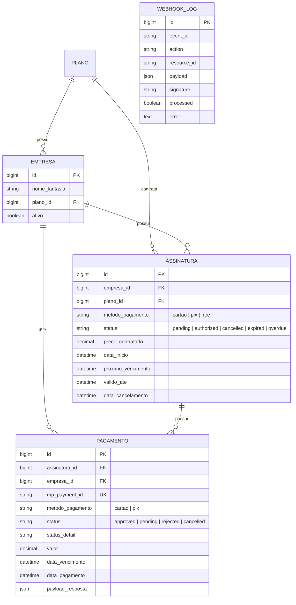
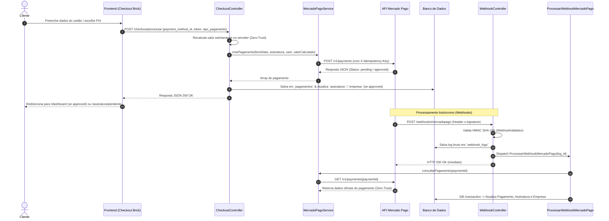

# Documentação Técnica da Integração com Mercado Pago — MecDesk SaaS

Este documento apresenta uma análise técnica completa da API de pagamentos e assinaturas do **MecDesk SaaS**, desenvolvida em Laravel. Foi estruturado especificamente para permitir que outro agente de IA ou desenvolvedor possa compreender, revisar e evoluir a implementação atual sem ambiguidades.

---

## 1. Visão Geral da Arquitetura

O módulo de pagamentos do MecDesk é responsável por gerenciar a contratação e renovação dos planos de assinatura das empresas parceiras via **Mercado Pago API v2**.

### Principais Pilares da Arquitetura:
* **Checkout Bricks SDK (Frontend)**: O formulário de pagamento é renderizado no lado do cliente utilizando a SDK oficial do Mercado Pago (`https://sdk.mercadopago.com/js/v2`), oferecendo suporte a Cartão de Crédito, Débito, PIX e Boleto.
* **Segurança Zero-Trust no Servidor**: O valor a ser cobrado **jamais é aceito a partir do payload do cliente**. O backend recalcula estritamente o valor com base no plano cadastrado no banco de dados.
* **Regra Estrita de Parcelamento**:
  * **Assinatura Mensal**: Permitida estritamente em **1x (parcela única)**. O backend sobrescreve qualquer tentativa do cliente de selecionar mais parcelas.
  * **Pagamento Único (Anual)**: Permite parcelamento em **até 12x no cartão**.
* **Processamento Assíncrono de Webhooks**: Os webhooks enviados pelo Mercado Pago são validados via **HMAC SHA-256**, gravados na tabela `webhook_logs`, e seu processamento é delegado a um Job em fila (`ProcessarWebhookMercadoPago`), garantindo resposta `HTTP 200 OK` instantânea à API do Mercado Pago.
* **Dupla Checagem de Segurança (Zero-Trust Webhook)**: O sistema não confia nos dados trafegados dentro do payload do webhook. Ao receber um evento, o Job consulta diretamente o endpoint `GET /v1/payments/{id}` da API do Mercado Pago para confirmar o valor e o status real antes de alterar o estado no banco de dados.
* **Automação de Renovação PIX**: Um comando de console (`mecdesk:renovar-assinaturas-pix`) identifica assinaturas ativas com método PIX prestes a vencer nos próximos 5 dias e gera proativamente as novas cobranças.

---

## 2. Mapeamento de Rotas Internas (MecDesk)

Todas as rotas do módulo de pagamento estão definidas em [`routes/web.php`](file:///c:/Users/workspace-dev/Mecdesk/routes/web.php).

| Rota | Método HTTP | Middleware | Controller / Handler | Descrição |
| :--- | :--- | :--- | :--- | :--- |
| `/webhooks/mercadopago` | `POST` | *Público* | `WebhookController@handle` | Recebe notificações de eventos (payment, preapproval) do Mercado Pago. |
| `/checkout/{plano:slug}` | `GET` | `auth` | `CheckoutController@show` | Exibe a tela de checkout (Payment Brick) ou ativa imediatamente se for o plano `free`. |
| `/checkout/processar` | `POST` | `auth` | `CheckoutController@processarPagamento` | Endpoint AJAX que recebe os dados do Brick, executa a cobrança no Mercado Pago e registra a transação. |
| `/planos/callback` | `GET` | `auth` | `CheckoutController@callback` | Rota de retorno após o fluxo de checkout (redireciona para Dashboard ou Pendente). |
| `/assinatura/pendente` | `GET` | `auth` | Closure | Renderiza a view `planos.pendente` se a empresa estiver inativa, ou redireciona para a Dashboard se já ativada. |
| `/assinatura/status` | `GET` | `auth` | Closure | Endpoint de polling AJAX utilizado pela tela de pendência para checar se a assinatura foi liberada pelo Webhook. |

---

## 3. Endpoints da API Externa Consumidos (Mercado Pago)

O serviço [`MercadoPagoService`](file:///c:/Users/workspace-dev/Mecdesk/app/Services/MercadoPago/MercadoPagoService.php) encapsula todas as chamadas HTTP enviadas para `https://api.mercadopago.com`.

### 3.1 `POST /v1/payments` — Criar Pagamento
* **Objetivo**: Processar pagamentos de cartão de crédito, PIX ou boleto.
* **Cabeçalhos Enviados**:
  * `Authorization: Bearer {MERCADOPAGO_ACCESS_TOKEN}`
  * `X-Idempotency-Key`: UUID v4 gerado a cada requisição (`Str::uuid()`) para impedir cobranças duplicadas em caso de retentativas de rede.
  * `Accept: application/json`
* **Payload Base**:
  ```json
  {
    "transaction_amount": 99.00,
    "description": "Assinatura Mensal MecDesk - Plano Pro",
    "payment_method_id": "visa",
    "external_reference": "12",
    "installments": 1,
    "payer": {
      "email": "usuario@cliente.com"
    },
    "notification_url": "https://meusite.com/webhooks/mercadopago"
  }
  ```
* **Comportamento em Ambiente Local**: Se `APP_ENV=local` e `MERCADOPAGO_SANDBOX_MOCK=true`, em caso de falha da API de testes do Mercado Pago (`internal_error`), um fallback simula uma resposta com status `approved` para permitir o desenvolvimento sem bloqueios.

### 3.2 `GET /v1/payments/{id}` — Consultar Pagamento
* **Objetivo**: Efetuar a dupla verificação de integridade ao receber uma notificação de Webhook.
* **Retorno Esperado**: Objeto JSON com `status`, `status_detail`, `transaction_amount`, `external_reference` (ID da Assinatura no MecDesk) e `payment_method_id`.

### 3.3 `GET /preapproval/{id}` — Consultar Assinatura Recorrente
* **Objetivo**: Verificar status de assinaturas recorrentes geradas nativamente pela API de Preapproval do Mercado Pago.

---

## 4. Detalhamento dos Componentes e Métodos

### 4.1 `CheckoutController`
Localizado em [`app/Http/Controllers/CheckoutController.php`](file:///c:/Users/workspace-dev/Mecdesk/app/Http/Controllers/CheckoutController.php).

* **`show(Plano $plano, Request $request)`**:
  1. Verifica se o plano selecionado possui slug `free`. Se sim:
     - Associa o `plano_id` à `Empresa`.
     - Cria ou atualiza a `Assinatura` com `status = 'authorized'`, `metodo_pagamento = 'free'`, `preco_contratado = 0.00`.
     - Marca `empresa.ativo = true` e redireciona ao Dashboard com mensagem de sucesso.
  2. Para planos pagos:
     - Identifica a modalidade solicitada (`mensal` ou `unico` via parâmetro `?tipo=`).
     - Calcula o valor real chamando `$plano->getPrecoForTipo($tipoPagamento)`.
     - Cria ou atualiza a `Assinatura` pendente da empresa.
     - Renderiza a view `planos.checkout` passando a `publicKey`, `amount`, `precoMensal` e `precoUnico`.

* **`processarPagamento(Request $request): JsonResponse`**:
  1. Valida a requisição AJAX (`payment_method_id`, `tipo_pagamento`).
  2. Localiza a assinatura ativa ou mais recente da empresa.
  3. **Zero-Trust**: Executa `$plano->getPrecoForTipo($tipoPagamento)` no servidor para obter o valor indiscutível.
  4. Chama `$this->mpService->criarPagamento(...)` injetando o valor calculado.
  5. Cria ou atualiza o registro em `Pagamento` (`mp_payment_id`, `status`, `status_detail`, `valor`, `payload_resposta`).
  6. Se o status retornado for `approved` (ex: aprovação instantânea no cartão):
     - Atualiza a `Assinatura` para `authorized`.
     - Define `data_inicio`, `proximo_vencimento` (1 mês para plano mensal, 12 meses para plano único) e `valido_ate`.
     - Marca `empresa.ativo = true`.
  7. Retorna o JSON da resposta do Mercado Pago com código `HTTP 200` (ou `422` em caso de exceção).

* **`callback(Request $request)`**:
  - Atualiza o model `Empresa` do banco de dados (`$empresa->refresh()`).
  - Se a empresa já estiver ativa (`$empresa->isAtiva()`), redireciona para `dashboard`.
  - Caso contrário, redireciona para `assinatura.pendente` aguardando a confirmação do webhook (ex: PIX ou Boleto).

---

### 4.2 `WebhookController` & `WebhookValidator`
Localizados em [`app/Http/Controllers/WebhookController.php`](file:///c:/Users/workspace-dev/Mecdesk/app/Http/Controllers/WebhookController.php) e [`app/Services/MercadoPago/WebhookValidator.php`](file:///c:/Users/workspace-dev/Mecdesk/app/Services/MercadoPago/WebhookValidator.php).

* **`WebhookController@handle`**:
  1. Extrai a ação (`action` ou `type`) e o ID do recurso (`data.id` ou `id`).
  2. Salva a requisição bruta na tabela `webhook_logs` (`event_id`, `action`, `resource_id`, `payload`, `signature`, `processed = false`).
  3. Aciona a validação de segurança `WebhookValidator::validate($request)`.
  4. Se a assinatura for inválida e não estiver em ambiente `local`/`testing`, atualiza o log com erro e encerra com `HTTP 401 Unauthorized`.
  5. Despacha o Job `ProcessarWebhookMercadoPago::dispatch($webhookLog->id)`.
  6. Retorna imediatamente `HTTP 200 OK` (`{'status': 'received', 'log_id': ...}`).

* **`WebhookValidator::validate`**:
  1. Extrai os cabeçalhos `x-signature` e `x-request-id`.
  2. Faz o parse do `x-signature` buscando os parâmetros `ts` (timestamp) e `v1` (hash HMAC).
  3. Monta a string de manifesto: `id:{dataId};request-id:{requestId};ts:{ts};`.
  4. Calcula o hash `hash_hmac('sha256', $manifest, $webhookSecret)`.
  5. Compara usando `hash_equals($expectedHash, $v1)` imune a ataques de tempo (timing attacks).

---

### 4.3 `ProcessarWebhookMercadoPago` (Queue Job)
Localizado em [`app/Jobs/ProcessarWebhookMercadoPago.php`](file:///c:/Users/workspace-dev/Mecdesk/app/Jobs/ProcessarWebhookMercadoPago.php).

* Configurado com `$tries = 3` para tolerância a falhas temporárias na fila.
* **Fluxo de Execução (`handle`)**:
  1. Carrega o `WebhookLog` pelo ID. Se já tiver sido processado (`processed == true`), aborta para evitar duplo processamento.
  2. Invoca o método `processarPagamento($mpService, $resourceId, $log)`.
* **Fluxo de `processarPagamento`**:
  1. Realiza chamada `consultarPagamento($paymentId)` na API do Mercado Pago (Dupla Checagem Zero-Trust).
  2. Extrai `external_reference` e localiza a `Assinatura`.
  3. Executa dentro de uma transação de banco de dados (`DB::transaction`):
     - Atualiza ou cria o registro em `pagamentos` via `updateOrCreate(['mp_payment_id' => $paymentId])`.
     - **Se `status === 'approved'`**:
       - Atualiza `assinatura.status = 'authorized'`, `metodo_pagamento`, `data_inicio`, `proximo_vencimento` (+1 mês) e `valido_ate` (+1 mês).
       - Atualiza `empresa.plano_id` e atribui `empresa.ativo = true`.
       - Dispara os eventos do ecossistema: `AssinaturaAtivada::dispatch($assinatura)` e `PagamentoRecebido::dispatch($pagamento)`.
     - **Se `status` for `rejected`, `cancelled`, `refunded` ou `charged_back`**:
       - Se a vigência atual da assinatura já venceu (`$assinatura->valido_ate->isPast()`), altera o status da assinatura para `overdue`.
  4. Marca `webhook_logs.processed = true`.

---

### 4.4 `RenovarAssinaturasPixCommand` (Console Command)
Localizado em [`app/Console/Commands/RenovarAssinaturasPixCommand.php`](file:///c:/Users/workspace-dev/Mecdesk/app/Console/Commands/RenovarAssinaturasPixCommand.php).

* **Comando Shell**: `php artisan mecdesk:renovar-assinaturas-pix`
* **Funcionamento**:
  1. Filtra assinaturas ativas (`status = 'authorized'`) com `metodo_pagamento = 'pix'` cuja data de vencimento (`valido_ate`) ocorra nos próximos 5 dias (`<= now()->addDays(5)`).
  2. Para cada assinatura encontrada:
     - Localiza o usuário administrador da empresa (`role = 'admin'`).
     - Chama `$mpService->criarPagamento(...)` enviando `payment_method_id = 'pix'`.
     - Cria o registro pendente na tabela `pagamentos` com vencimento em 3 dias (`data_vencimento = now()->addDays(3)`).
     - Atualiza a assinatura com o novo `proximo_vencimento`.

---

## 5. Modelagem de Dados e Estados



---

## 6. Fluxo de Vida de uma Transação



---

## 7. Mecanismos de Segurança e Resiliência Implementados

1. **Prevenção de Modificação de Preços (Client Price Tampering)**: O parâmetro `transaction_amount` nunca é lido da requisição HTTP do usuário. O valor é obtido a partir de `$plano->getPrecoForTipo($tipoPagamento)` no backend.
2. **Restrição Estrita de Parcelamento (Installments Rule)**: Mensalidades são forçadas a `installments = 1`, mesmo se o cliente tentar enviar outro valor via POST manipulado.
3. **Idempotência de Requisições HTTP**: O cabeçalho `X-Idempotency-Key` evita duplicação de cobranças quando houver timeouts ou reenvios HTTP para a API do Mercado Pago.
4. **Idempotência no Banco de Dados**: A criação de registros em `pagamentos` utiliza `updateOrCreate` fundamentado no identificador único do Mercado Pago (`mp_payment_id`).
5. **Proteção contra Spoofing de Webhooks**: Verificação rigorosa do header `x-signature` com algoritmo HMAC SHA-256 e `hash_equals`.
6. **Proteção da Coluna `ativo`**: No model `Empresa`, o atributo `ativo` foi removido propositalmente da propriedade `$fillable` para impedir vulnerabilidades de *Mass Assignment*.

---

## 8. Cobertura de Testes Automatizados

A implementação conta com suítes de testes de integração escritas em **Pest PHP**:

* [`tests/Feature/CheckoutTest.php`](file:///c:/Users/workspace-dev/Mecdesk/tests/Feature/CheckoutTest.php):
  * Ativação automática ao selecionar plano gratuito (`free`).
  * Renderização correta do Payment Brick na tela de checkout.
  * Garantia de que cobranças mensais forçam `installments = 1` na chamada da API do Mercado Pago.
  * Verificação de que pagamentos únicos anuais utilizam o `preco_unico` e permitem parcelamento em até 12x.
  * Validação de rejeição contra tentativas de alteração de preço pelo cliente.
* [`tests/Feature/WebhookTest.php`](file:///c:/Users/workspace-dev/Mecdesk/tests/Feature/WebhookTest.php):
  * Recebimento e gravação de payload no endpoint `/webhooks/mercadopago`.
  * Teste do Job `ProcessarWebhookMercadoPago` simulando a dupla verificação e a ativação da empresa/assinatura em caso de pagamento aprovado.

---

## 9. Observações para a Próxima Revisão / Melhorias Futuras

* **Webhooks de Recorrência Integrada (`preapproval`)**: Se o sistema futuramente optar por migrar da renovação via CLI/PIX para a API nativa de assinaturas do Mercado Pago (`/preapproval`), o Job `ProcessarWebhookMercadoPago` já possui estrutura pronta para tratar ações contendo a palavra `preapproval`.
* **Notificações por E-mail**: Recomenda-se conectar os eventos `AssinaturaAtivada` e `PagamentoRecebido` a listeners de envio de e-mail (ex: e-mail de boas-vindas ou comprovante de pagamento ao cliente).
* **Gestão de Expirados**: O comando de renovação PIX atual gera a nova cobrança. Pode ser adicionado um alerta prévio por e-mail ou WhatsApp para o administrador da oficina 3 dias antes da data de expiração.
